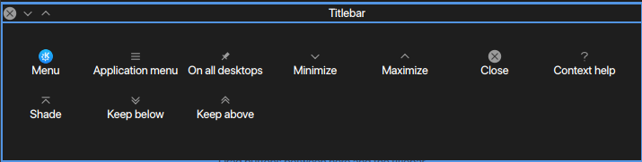

# Setting the Themes

You may notice that, after [Setting up the dock,](./dock.md) we didn't change the theme or window decorations yet. We are going to do that now.

1. Open KDE System Settings.
2. Go to Workspace Theme > Desktop Theme.
3. Select Breze Dark with No Shadow and Transparency.
  - Click Apply after every change you make.
4. Close System Settings.
5. Extract the Mojave Dark theme somewhere. (It doesn't have to be in your .themes folder.)
6. Extract McOS-MJV-Dark into your .themes folder.
  - You should already have Show Hidden Files turned on. You can turn it off after this tutorial.
  - Make the .themes folder in your home directory if it doesn't already exist.
7. Open Kvantum Manager.
8. Click Select a Kvantum theme folder.
9. Open the folder that came out when you extracted Mojave Dark.
10. Click Install this theme.
11. Go to Change/Delete Theme.
12. Open the dropdown menu and then click Mojave-dark.
13. Close Kvantum Manager and reopen KDE System Settings.
14. Go to Application Style > Widget Style.
15. Open the dropdown next to Widget style and click Kvantum-dark.
16. Go to GNOME Application Style (GTK).
17. Change both the GTK2 and GTK3 themes to McOS-MJV-Dark-v2.0.
18. Go to Window Decorations.
19. Change the window decorations to Mojave Dark Aurorae.
20. Click Configure Mojave Dark Aurorae and change the button size to Large.
21. Click Buttons and move the buttons so that they look like this:

22. Go back to GNOME Application Style (GTK).
  - At this point, I assume you have either Captain Font or otf-san-franciscoAUR installed.
  - Captain Font's San Francisco font is labeld SFNS, while otf-san-francisco is labeled as SF Pro.
  - Substitute "sf-font" for your San Francisco font.
23. Change the font to "sf-font".
24. Go to the main Settings menu > Fonts.
25. Change the General, Small, Toolbar, Menu, and Window title fonts to "sf-font".
26. Go to the main Settings menu > Colors.
27. Select KvantumAlt.
28. Go to Icons and set it to MacBuntu-OS.
29. Reboot to get the fonts to display properly.

**Continue with [Setting up Effects.](./effects.md)**

{\(Table of Contents\)}